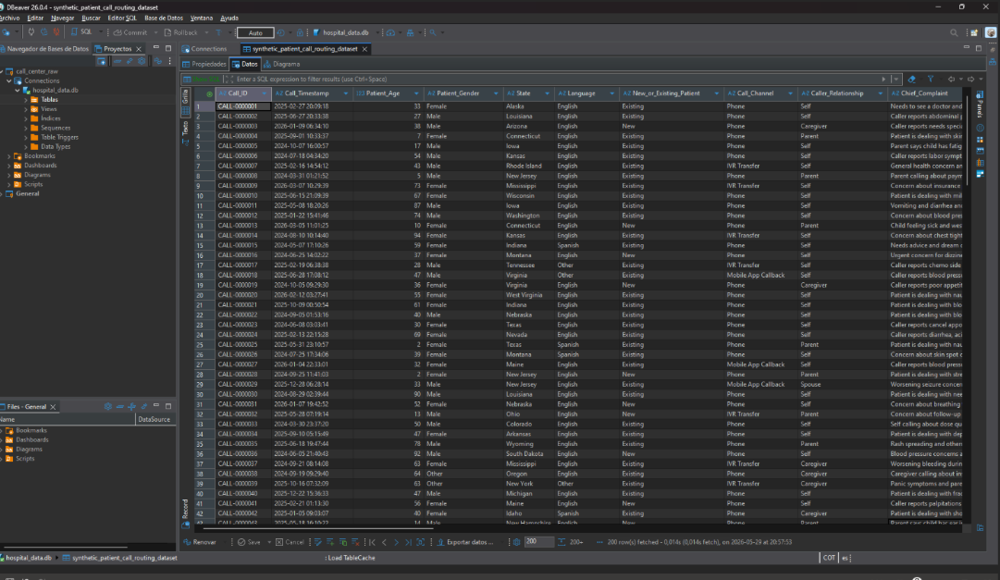
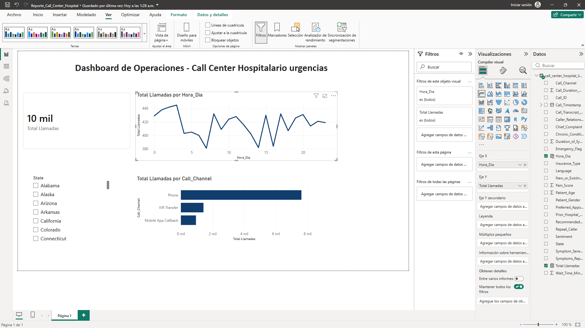
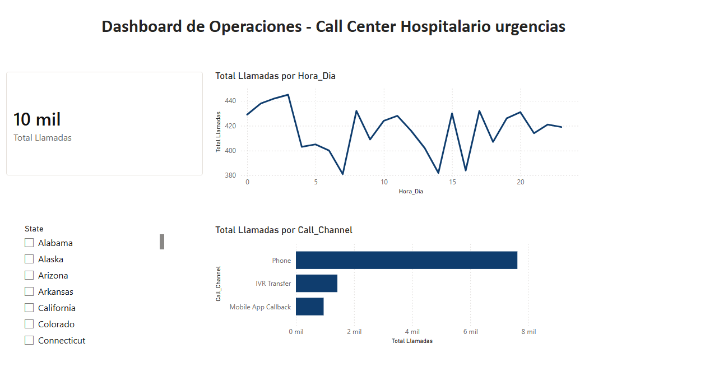

# 📊 Análisis de Operaciones - Call Center Hospitalario de Urgencias

Este repositorio expone un proyecto completo de **Analítica e Ingeniería de Datos (End-to-End)** cuyo objetivo es auditar y optimizar el flujo operativo del servicio de atención telefónica de urgencias de un centro de salud, basándose en un histórico de **10,000 registros**. El pipeline abarca desde el aprovisionamiento en base de datos y limpieza con SQL, hasta el modelado analítico mediante expresiones DAX y el diseño de una interfaz ejecutiva interactiva en Power BI.

---

## 🛠️ Arquitectura de Herramientas

* **DBeaver (Community Edition):** Administrador de bases de datos utilizado para la gestión de conexiones de datos, mapeo de estructuras (`Tables mapping`) e importación controlada de grandes volúmenes de información.
* **SQL (Estructuración y Limpieza):** Implementación de reglas de negocio para la limpieza profunda, normalización de tipos de datos, corrección de inconsistencias e integridad en la tabla base `call_center_hospital_limpio`.
* **Power BI Desktop:** Motor analítico encargado del modelado conceptual, desarrollo de cálculos métricos mediante **DAX (Data Analysis Expressions)** y diseño de la interfaz visual dinámica.

---

## 🔄 El Proceso Técnico Paso a Paso (ETL)

El desarrollo del proyecto se ejecutó siguiendo las fases del ciclo de vida tradicional del manejo de datos:

### 1. Conexión y Migración (DBeaver)
La base del proyecto se estructuró parametrizando el asistente de transferencia de datos en **DBeaver**. Se configuró rigurosamente el formato de codificación en **`UTF-8`**, se definió la posición de las cabeceras de las columnas y el delimitador de campos para asegurar una ingesta sin pérdida de caracteres especiales.

## 📈 Dashboard Gerencial e Insights de Operación

Configuracion 

El lienzo final del tablero fue maquetado bajo una distribución ejecutiva limpia y funcional, permitiendo que todos los elementos visuales se recalculen automáticamente mediante el uso de un segmentador por Estado federado (`State`).

### 💡 Hallazgos Críticos de Negocio (Insights):
* **Canales Críticos:** El canal de contacto telefónico directo (`Phone`) representa el núcleo de la demanda.
  
#### 🕒 2. Patrones Cíclicos de Horas Pico (Saturación)
El análisis del volumen temporal basado en la columna calculada `Hora_Dia` demostró que la demanda del centro de salud no es lineal ni constante a lo largo de la jornada, revelando picos y valles operativos críticos para la planeación del personal:

* **Pico Crítico Principal (Madrugada):** Se sitúa de forma contraintuitiva en las primeras horas de la noche y madrugada (específicamente entre las **0:00 y las 3:00 am**), registrando volúmenes que superan las 440 llamadas por hora.
* **Pico Secundario (Tarde):** Se presenta a mitad de la tarde, concretamente entre las **3:00 pm y 4:00 pm (horas 15 y 16)**.
* **Valle de Demanda:** El punto con menor actividad y saturación en las líneas telefónicas se registra sobre las **6:00 am**.
